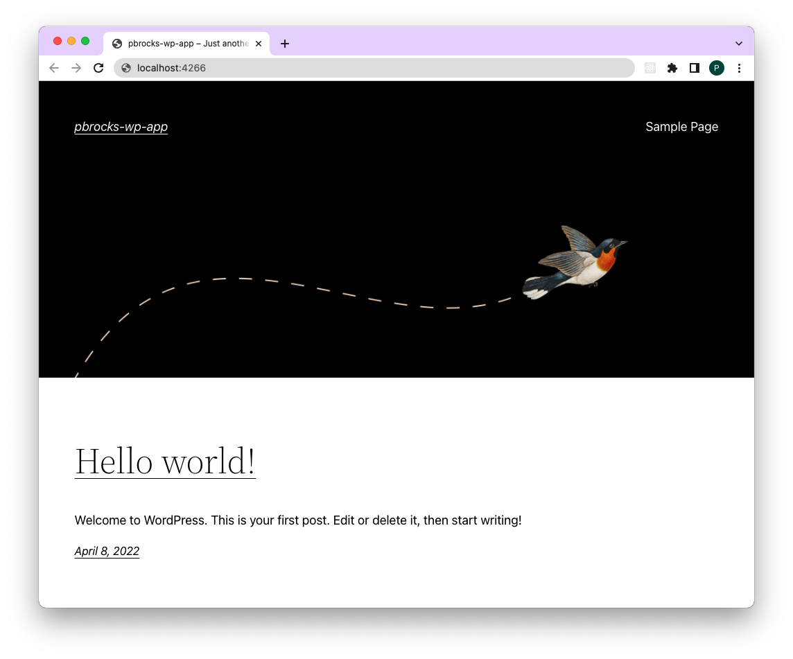
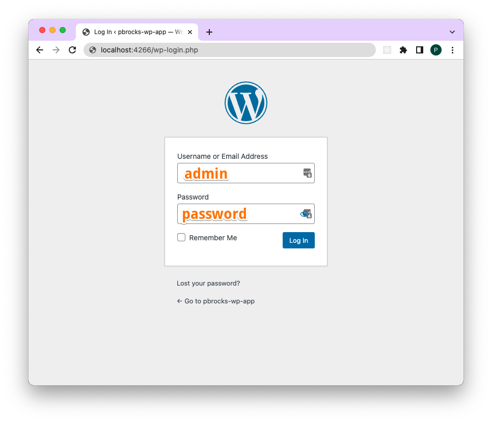
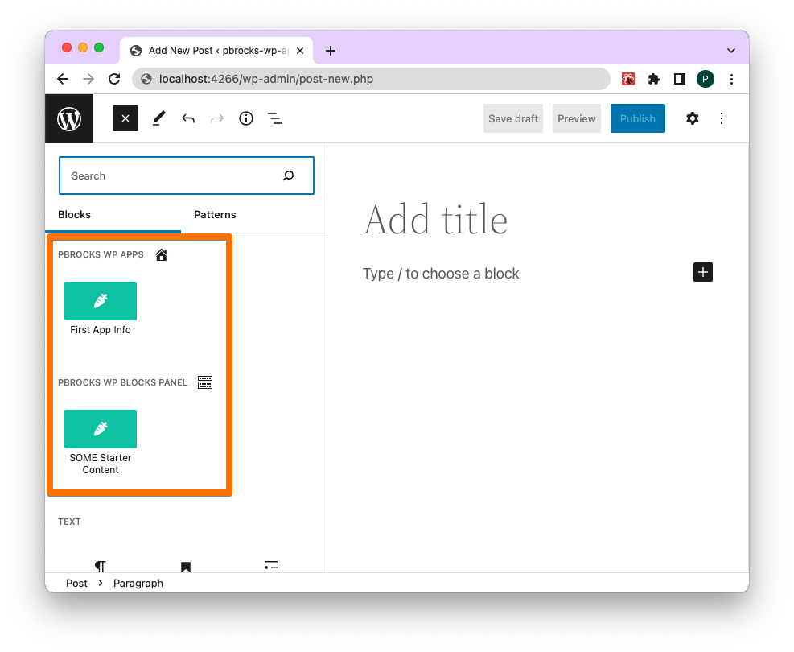

# pbrocks-wp-app

## `wp-env`

### Getting Started

#### Prerequisites: Docker

For more info: [block-editor/reference-guides](https://developer.wordpress.org/block-editor/reference-guides/packages/packages-env/#prerequisites)

### Install `wp-env` locally

Install as a global npm package on your local machine.

```sh
npm -g i @wordpress/env
```

### Startup config `.wp-env-json`

This plugin comes with a preconfigured in the root directory. Alter as needed. If left unchanged, this plugin will create an environment that runs on port 4266, as in: `http://localhost:4266`.

### To set up environment

After ensuring Docker is running and the `@wordpress/env` is installed, type:

```sh
wp-env start
```

This will configure a local WordPress environment using Docker and when set up, return the URLs to access both the development and testing environments.

To end your session, type:

```sh
wp-env stop
```

### Splash Screen

Assuming things went according to plan, you should see:



### Login Screen

Logging in is no different than any other fresh WordPress installation:

```
http://localhost:4266/wp-login.php
```



### New Post > Add Block

Start a new post or page and click the blue button of the block inserter and you will see two starter blocks:



## More Info

For more complete reference, consult: [the Block Editor Handbook page](https://developer.wordpress.org/block-editor/reference-guides/packages/packages-env/#3-restart-wp-env)
